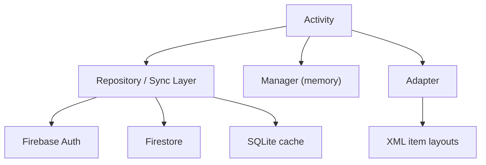

# SYshop Project Documentation

## 1. Project Overview

`SYshop` is a native Android e-commerce application built with Java, XML layouts, Firebase services, Glide image loading, and a small local SQLite cache.

The app currently supports:

- product listing on the home screen
- category filtering and search
- product details with image gallery and zoom viewer
- user authentication
- favorites
- cart management
- checkout and order history
- profile viewing and editing

The codebase uses a simple Activity-based architecture instead of MVVM or Jetpack Compose. Most business logic lives directly inside Activities, Adapters, and Repository-style classes.

## 2. Tech Stack

### Build and platform

- Android Gradle Plugin `9.1.0`
- Java `11`
- `minSdk 24`
- `targetSdk 36`
- single application module: `:app`

### Main libraries

- `androidx.appcompat`
- Material Components / Material3 theme
- `RecyclerView`
- `CardView`
- `ConstraintLayout`
- `Glide 4.16.0` for image loading
- Firebase BOM `34.11.0`
- Firebase Auth
- Firebase Firestore
- Firebase Analytics
- Firebase Storage dependency is included, but current app logic does not actively use Storage APIs

## 3. High-Level Architecture

The project is organized by feature type rather than domain modules:

- `activities/`: screen controllers and user flows
- `adapters/`: RecyclerView and ViewPager adapters
- `database/`: Firestore sync + local SQLite cache access
- `managers/`: in-memory session state for cart and favorites
- `models/`: plain Java data objects
- `utils/`: auth guard, avatar binding, shared navigation helpers
- `views/`: custom reusable UI view (`ZoomableImageView`)
- `res/layout`: XML screen and item layouts
- `res/drawable`: backgrounds, icons, and local product/banner images

### Runtime data flow



### Important architectural idea

The app mixes 3 storage levels:

1. `static memory`
2. `local SQLite cache`
3. `Firestore cloud data`

That gives the app fast UI startup and partial offline resilience, but it also means each feature has to reconcile local state with remote state manually.

## 4. Project Structure

### Main screen classes

- `MainActivity`: home screen, offers, categories, promo rail, product grid, bottom navigation
- `SearchActivity`: search UI, suggestions, category discovery, filtered results
- `ProductDetailsActivity`: product details, rating display, favorites, quantity, add to cart
- `ProductImageViewerActivity`: fullscreen zoomable image gallery
- `CartActivity`: cart list, total calculation, checkout confirmation
- `FavoritesActivity`: favorite items list and sync
- `OrdersActivity`: order history
- `OrderDetailsActivity`: individual order contents
- `LoginActivity`: sign in + password reset
- `RegisterActivity`: account creation
- `ProfileActivity`: user profile display and logout
- `EditProfileActivity`: profile editing and preset avatar selection

### Core supporting classes

- `ProductRepository`: reads products from Firestore and maintains memory cache
- `ProductCacheRepository`: stores products in SQLite
- `FavoriteSyncRepository`: syncs favorites to Firestore and cache
- `FavoriteCacheRepository`: stores favorites in SQLite
- `CartSyncRepository`: syncs cart items to Firestore
- `OrderSyncRepository`: checkout, orders list, order item loading
- `CartManager`: in-memory cart state
- `FavoriteManager`: in-memory favorites state
- `AuthManager`: login requirement helper
- `Navigator`: shared product details navigation
- `AvatarUtils`: profile avatar rendering logic

## 5. Data Model

### `Product`

Main commerce model. Stores:

- `id`
- `category`
- `tag`
- `name`
- `price`
- `description`
- `imageRes`
- `imagesList`
- `imageUrl`
- `hasOffer`
- `discountPercent`
- `oldPrice`
- `rating`
- `reviewCount`

Important logic inside `Product`:

- `fromMap(...)` converts Firestore maps into app objects
- `toStorageMap()` converts app objects back to Firestore-friendly data
- `getPreferredLocalImageRes()` maps product/category names to bundled drawable fallback images
- `hasRemoteImageUrl()` decides whether Glide should load from network or local resources

### Other models

- `CartItem`: product + quantity
- `Order`: order header information
- `OrderItem`: product snapshot saved inside an order
- `UserProfile`: name, email, phone, address, avatar metadata
- `CachedProduct`: SQLite cache representation of products
- `Category`: UI-only category chip/card model

## 6. Storage and Backend Design

### Firebase Auth

Used for:

- login
- registration
- current-user detection
- password reset
- user-specific Firestore paths

### Firestore collections

#### Global products

`products/{productId}`

Expected fields include:

- `id`
- `category`
- `tag`
- `name`
- `price`
- `description`
- `image_res` or `image`
- `images`
- `imageUrl`
- `hasOffer`
- `discountPercent`
- `oldPrice`
- `rating`
- `review_count` or `reviewCount`

#### Per-user root

`users/{uid}`

Profile document fields:

- `fullName`
- `email`
- `phone`
- `address`
- `avatarUrl`
- `avatarPreset`

#### User favorites

`users/{uid}/favorites/{productId}`

Stores a snapshot of the product using `Product.toStorageMap()`.

#### User cart

`users/{uid}/cart/{productId}`

Stores:

- product snapshot
- `quantity`

#### User orders

`users/{uid}/orders/{orderId}`

Stores:

- `orderId`
- `totalPrice`
- `status`
- `createdAt`
- `itemsCount`

Order items live under:

`users/{uid}/orders/{orderId}/items/{productId}`

Each item stores product snapshot fields plus:

- `productId`
- `quantity`

### Local SQLite cache

Database name: `syshop_local.db`

Tables:

- `products_cache`
- `favorites_cache`

Both tables store nearly the same product snapshot fields:

- `id`
- `category`
- `tag`
- `name`
- `price`
- `description`
- `image_res`
- `image_url`
- `rating`
- `review_count`

### In-memory session managers

#### `CartManager`

- keeps cart items in a static `List<CartItem>`
- used for instant badge updates and cart rendering
- cleared after successful checkout

#### `FavoriteManager`

- keeps favorites in a static `List<Product>`
- used for quick favorite icon state across screens
- refreshed from cache/cloud in favorites flow

## 7. Screen-by-Screen UI and Logic

### 7.1 Main Screen (`MainActivity`)

### UI composition

The home screen is built from:

- a blue gradient header
- search icon
- cart icon with badge
- horizontal offer/banner carousel
- horizontal category list
- horizontal promo products rail
- 2-column product grid
- bottom navigation

### Logic flow

When `MainActivity` starts:

1. it initializes UI, adapters, and repositories
2. it builds the hardcoded category list
3. it loads products in layers:
   - memory cache from `ProductRepository`
   - SQLite cache from `ProductCacheRepository`
   - Firestore from `ProductRepository.loadProducts(...)`
4. if Firestore fails and no cache is available, it loads built-in fallback products from code
5. it builds:
   - offer banners from products with `hasOffer` or tag `Promo`
   - promo list from products tagged `Promo`
   - main product grid

### Filtering behavior

- category taps call `ProductAdapter.setCategory(...)`
- promo "See all" applies tag filter `Promo`
- general "See all" resets all filters
- empty-state text is shown when filters produce no visible items

### Offer slider behavior

- horizontal `RecyclerView`
- `PagerSnapHelper` used like a pager
- auto-advances every `4200ms`
- indicators are rendered dynamically
- auto-slide pauses while the user drags

### Cart and favorites behavior

- cart badge reads from `CartManager`
- favorite icons refresh in `onResume()`
- bottom nav sends logged-in users to Orders, Favorites, and Profile
- unauthenticated users are redirected to login via `AuthManager.requireLogin(...)`

### 7.2 Search Screen (`SearchActivity`)

### UI composition

- back button
- rounded search input
- horizontally scrollable category strip with image cards
- top search/suggestion chips
- result header
- 2-column product grid

### Behavior modes

The screen has 3 visual states:

1. `discovery mode`
2. `suggestion mode`
3. `results mode`

#### Discovery mode

Shown when query is empty:

- category strip visible
- top searches visible
- best selling result list visible

#### Suggestion mode

Shown while the user types non-empty text but has not explicitly submitted:

- category strip hidden
- suggestion chips shown
- result grid hidden

#### Results mode

Shown when search is submitted:

- suggestions hidden
- results header shows `Results for "..."`
- adapter filter is applied using `setSearchQuery(...)`

### Product loading

Like the home screen, search tries:

1. memory cache
2. SQLite cache
3. Firestore

### Search matching logic

`ProductAdapter` matches query against:

- product name
- tag
- description
- category

### 7.3 Product Details (`ProductDetailsActivity`)

### UI composition

- top bar with back and cart
- image `ViewPager2`
- image position indicator
- favorite button
- product info card
- ratings/reviews card
- description card
- bottom action bar with quantity stepper and add-to-cart button

### Data loading logic

The activity receives `product_id` through the intent.

Load order:

1. `ProductRepository` memory cache
2. `ProductCacheRepository` SQLite cache
3. Firestore `loadProductById(...)`

If cached data exists, the screen renders immediately, then refreshes when Firestore returns.

### Image logic

- uses `ProductImagePagerAdapter`
- if `imageUrl` is valid, remote image is used
- otherwise local drawable list is used
- tapping the image opens `ProductImageViewerActivity`

### Favorite logic

- state is considered favorite if it exists in `FavoriteManager` or SQLite favorite cache
- tap toggles favorite in:
  - memory
  - SQLite
  - Firestore

### Cart logic

- quantity stepper is local UI state
- add-to-cart updates:
  - `CartManager`
  - `CartSyncRepository`
- top cart badge is updated from `CartManager`

### Rating display logic

The rating breakdown bars are not loaded from real per-star review data. They are derived mathematically from `rating` and `reviewCount` for presentation only.

### 7.4 Fullscreen Image Viewer (`ProductImageViewerActivity`)

### Purpose

Displays product images in fullscreen with swipe and zoom.

### How it works

- receives image list, image URL, and start position
- uses `ZoomableImagePagerAdapter`
- each page contains `ZoomableImageView`
- indicator text shows current page like `1 / N`

### `ZoomableImageView`

Custom view that supports:

- pinch-to-zoom
- dragging while zoomed
- min scale `1x`
- max scale `4x`
- translation clamping so the image stays within bounds

### 7.5 Cart (`CartActivity`)

### UI composition

- gradient header with back button
- item count text
- order total card
- checkout button
- empty state or cart item list

### Load logic

1. reads local in-memory cart from `CartManager`
2. binds `CartAdapter`
3. requests cloud cart with `CartSyncRepository.loadCartFromCloud(...)`
4. if cloud data returns, it clears memory cart and rebuilds it from Firestore data

### Quantity update behavior

Inside `CartAdapter`:

- plus increases quantity in `CartManager` and updates Firestore
- minus decreases quantity or removes item
- item tap opens product details

### Total calculation

The total is computed locally by parsing price strings like `"$89"` into doubles and multiplying by quantity.

### Checkout flow

1. user presses checkout
2. app loads current `UserProfile` from `users/{uid}`
3. app opens `dialog_checkout_confirmation`
4. if phone/address are missing:
   - dialog guides user to Edit Profile
5. if profile is ready:
   - user can place order
6. `OrderSyncRepository.checkout(...)`:
   - creates new order document
   - creates item subcollection
   - deletes all cart documents in batch
7. on success:
   - clears `CartManager`
   - refreshes cart UI
   - navigates to Orders

### 7.6 Favorites (`FavoritesActivity`)

### UI composition

- header with title and cart badge
- favorite list or empty state
- bottom navigation

### Load strategy

Favorites are built from multiple sources:

1. `FavoriteManager` in-memory items
2. `FavoriteCacheRepository` SQLite data
3. Firestore favorites from `FavoriteSyncRepository`

### Enrichment logic

Because favorite snapshots may be incomplete, the screen enriches favorites with better product data from:

- `ProductCacheRepository`
- `ProductRepository` memory cache
- later, individual Firestore product fetches

This improves image URLs, descriptions, ratings, and other fields.

### Removal logic

When removing a favorite from the list:

- it is removed from `FavoriteManager`
- deleted from SQLite cache
- deleted from Firestore
- removed from adapter list

### 7.7 Orders (`OrdersActivity`)

### UI composition

- header with cart badge
- summary card at top
- empty state or orders list
- bottom navigation

### Loading logic

- loads orders from `users/{uid}/orders`
- sorts descending by `createdAt`
- maps Firestore documents to `Order` objects
- updates summary text based on order count

### Navigation

Tapping an order opens `OrderDetailsActivity` with header values passed in the intent.

### 7.8 Order Details (`OrderDetailsActivity`)

### UI composition

- header with back button
- order summary card
- ordered products card
- item list or empty state

### Logic flow

1. receives `orderId`, `status`, `totalPrice`, `createdAt`, and `itemsCount` through the intent
2. loads order item subcollection from Firestore
3. maps each item into `OrderItem`
4. enriches items with product image data from:
   - memory cache
   - SQLite cache
   - Firestore product fetch fallback

### Product reopen behavior

When a user taps an ordered item:

- app reconstructs a `Product` object from `OrderItem`
- navigates back to `ProductDetailsActivity`

### 7.9 Login (`LoginActivity`)

### UI composition

- gradient hero header
- white card form
- email and password fields
- forgot password link
- sign-in button
- loading state
- link to register

### Logic

- if user is already signed in, activity immediately opens `MainActivity`
- validates email format and minimum password length
- signs in with Firebase Auth
- forgot password sends Firebase reset email

### 7.10 Register (`RegisterActivity`)

### UI composition

- gradient header
- white form card
- full name, email, password, confirm password
- create account button
- loading state
- link back to login

### Logic

1. validates fields
2. creates Firebase Auth account
3. writes `UserProfile` into `users/{uid}`
4. default avatar preset is `AvatarUtils.PRESET_USER`
5. opens main screen on success

### 7.11 Profile (`ProfileActivity`)

### UI composition

- gradient header
- large profile card
- avatar area with image or initials
- contact section
- shipping section
- edit profile button
- logout button
- bottom navigation

### Logic

- requires logged-in user
- loads `users/{uid}` document on `onResume()`
- binds avatar through `AvatarUtils.bindAvatar(...)`
- falls back to initials and placeholder values if data is missing
- logout signs out Firebase Auth and returns to main screen

### 7.12 Edit Profile (`EditProfileActivity`)

### UI composition

- gradient header with back button
- profile edit card
- avatar preview
- preset avatar selection buttons
- full name, phone, address fields
- save button

### Logic

- loads current profile from Firestore
- allows selecting one of 3 avatar presets:
  - `user`
  - `man`
  - `woman`
- updates preview live when full name changes
- saves back to `users/{uid}`

### Important note

The current implementation stores avatar preset only. Although the project has avatar URL support in `UserProfile` and `AvatarUtils`, `EditProfileActivity` currently saves an empty `avatarUrl`, so custom remote avatars are not actively configured from the current UI.

## 8. Adapter Responsibilities

### Product list adapters

- `ProductAdapter`: main product grid, filtering, add to cart, favorite toggle
- `PromoAdapter`: promo rail cards, add to cart, favorite toggle
- `OfferSliderAdapter`: large marketing banner cards with styled accents

### List/detail adapters

- `CartAdapter`: cart quantity changes and product opening
- `FavoriteAdapter`: favorite item rendering and removal
- `OrderAdapter`: order summary cards
- `OrderItemsAdapter`: order item cards

### Image adapters

- `ProductImagePagerAdapter`: product image carousel in details
- `ZoomableImagePagerAdapter`: fullscreen image viewer
- `ProductImagesAdapter`: small image strip helper, currently not central to current main flows

## 9. Navigation Model

### Primary navigation

Bottom navigation is used on:

- home
- orders
- favorites
- profile

Tabs:

- Home
- Orders
- Favorites
- Profile

### Shared navigation behavior

`BaseActivity` centralizes:

- fade in/out transitions
- common `navigateTo(...)`
- back-to-home behavior when screen is task root

### Product navigation

`Navigator.openProductDetails(...)` is the shared entry point used by adapters and order details.

## 10. UI Design System

The app uses a consistent visual language:

- light blue/gray page background
- strong blue gradient headers
- rounded white cards
- pill badges
- soft borders and elevated surfaces
- custom bottom navigation selectors

### Key UI resources

- `colors.xml`: defines the main palette
- `themes.xml`: Material3 no-action-bar theme + custom bottom nav styling
- `bg_header.xml`: gradient header treatment
- `bg_search.xml`: rounded search/input surfaces
- `bg_empty_state.xml`: reusable empty-state card background
- `bg_soft_card.xml`, `bg_tag_badge.xml`, `bg_status_chip.xml`: reusable card and chip surfaces

### Motion and feedback

- fade transitions between screens
- layout/list enter animations
- animated cart badge in home screen
- heart scale animation on favorite toggle
- auto-advancing offer carousel

## 11. Detailed Logic Flows

### Product loading flow

```text
UI requests products
-> memory cache
-> SQLite cache
-> Firestore
-> fallback hardcoded products if remote fails and no cache exists
```

### Favorite flow

```text
Tap favorite
-> require login
-> toggle in FavoriteManager
-> save/remove in SQLite cache
-> save/remove in Firestore
-> refresh adapters
```

### Cart flow

```text
Tap add to cart
-> require login
-> update CartManager
-> sync quantity to Firestore cart
-> update badge/UI
```

### Checkout flow

```text
Tap checkout
-> load profile
-> validate phone/address
-> show confirmation dialog
-> create order + order items in Firestore
-> delete cart documents
-> clear local cart
-> open Orders screen
```

## 12. Current Behavioral Notes

These are not necessarily bugs; they are important implementation details for anyone maintaining the app.

- Cart and favorites depend on static in-memory managers, so session state is process-local until synced or reloaded.
- Product loading intentionally prefers cached content first, then refreshes from Firestore.
- Favorites are stored as product snapshots, then enriched later with newer product data.
- Order items are also stored as snapshots, so order history can still show item details even if the live product changes later.
- Firebase Storage is included in dependencies, but the current UI does not upload files.
- Search suggestions are derived from current product/category/tag data rather than a separate search index.
- Rating breakdown bars on product details are calculated UI values, not actual review histogram data from backend.

## 13. Testing Status

The repository currently only contains default template tests:

- `app/src/test/java/com/example/SYshop/ExampleUnitTest.java`
- `app/src/androidTest/java/com/example/SYshop/ExampleInstrumentedTest.java`

There is no meaningful automated coverage yet for:

- authentication flows
- repository logic
- cart synchronization
- checkout/order creation
- favorites sync
- search filtering
- UI rendering

## 14. Good Entry Points for Future Developers

If someone is new to the codebase, the best reading order is:

1. `MainActivity`
2. `ProductAdapter`
3. `ProductRepository`
4. `ProductDetailsActivity`
5. `CartActivity` + `CartSyncRepository`
6. `FavoritesActivity` + favorite repositories
7. `OrdersActivity` + `OrderSyncRepository`
8. `ProfileActivity` + `EditProfileActivity`

## 15. Summary

`SYshop` is a classic Activity-based Android shopping app that combines:

- Firebase Auth for identity
- Firestore for cloud product/user/cart/order data
- SQLite for local cache
- static managers for fast in-session state
- XML layouts and RecyclerViews for the UI

The most important logic pattern in this project is the repeated combination of:

- local memory state
- local SQLite cache
- remote Firestore sync

That pattern is what makes the home screen, search, favorites, product details, cart, and orders all work together.
